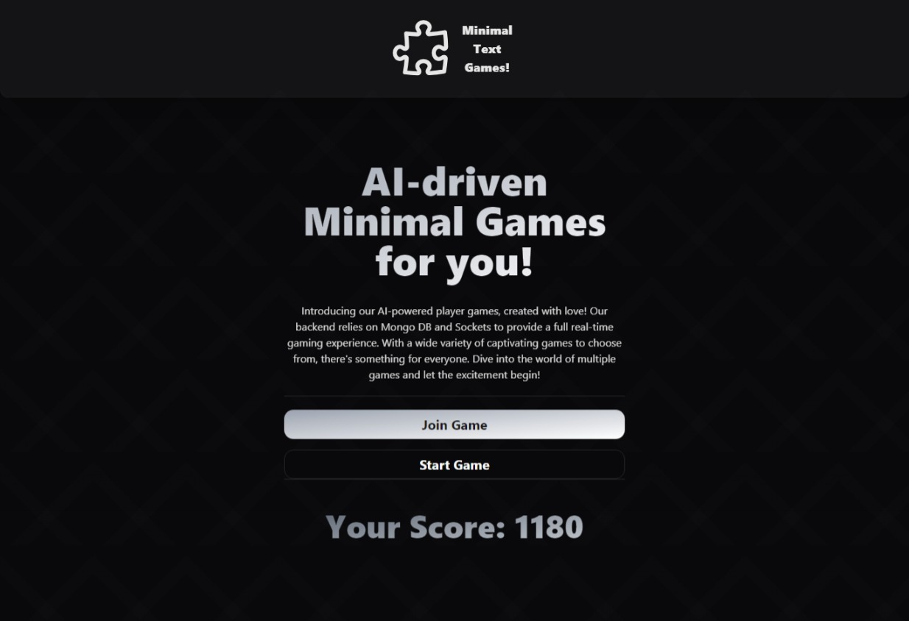
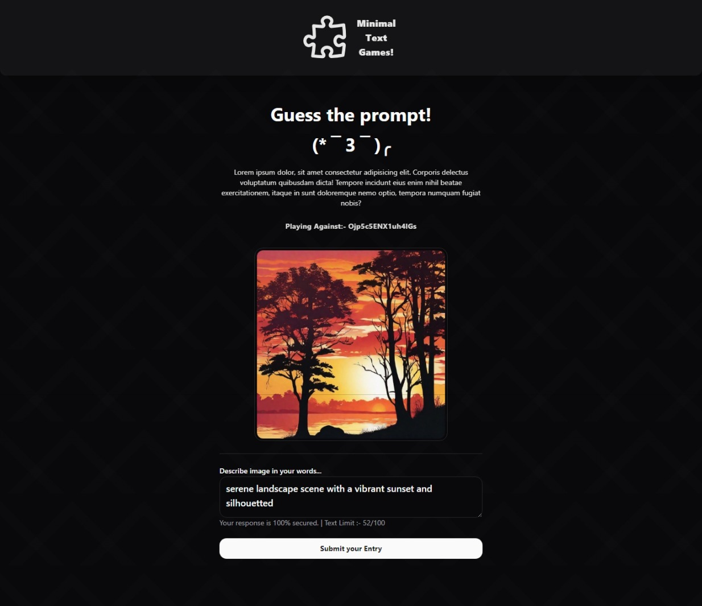
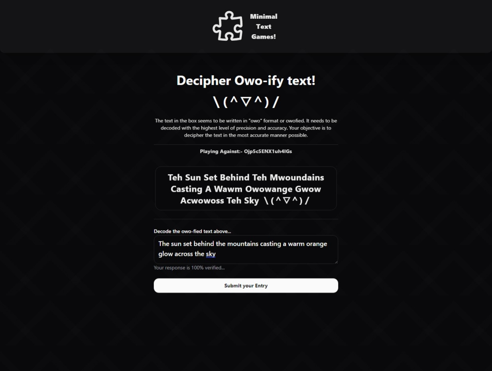
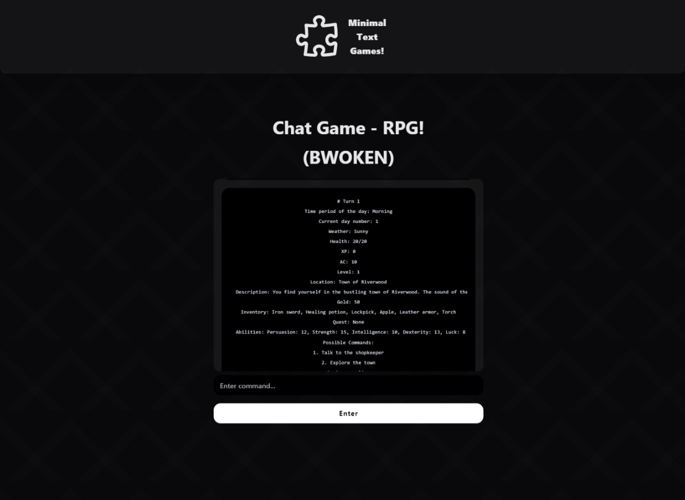
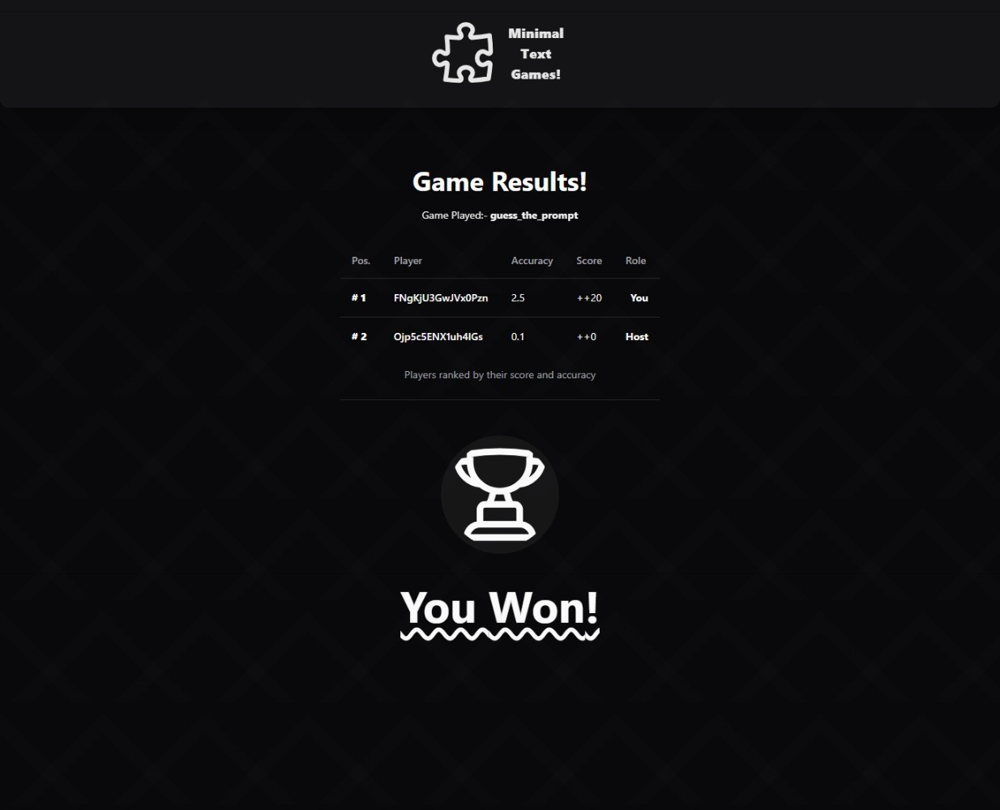
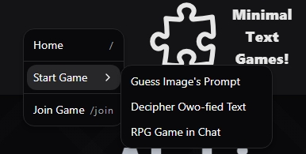
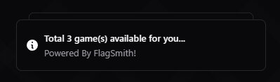
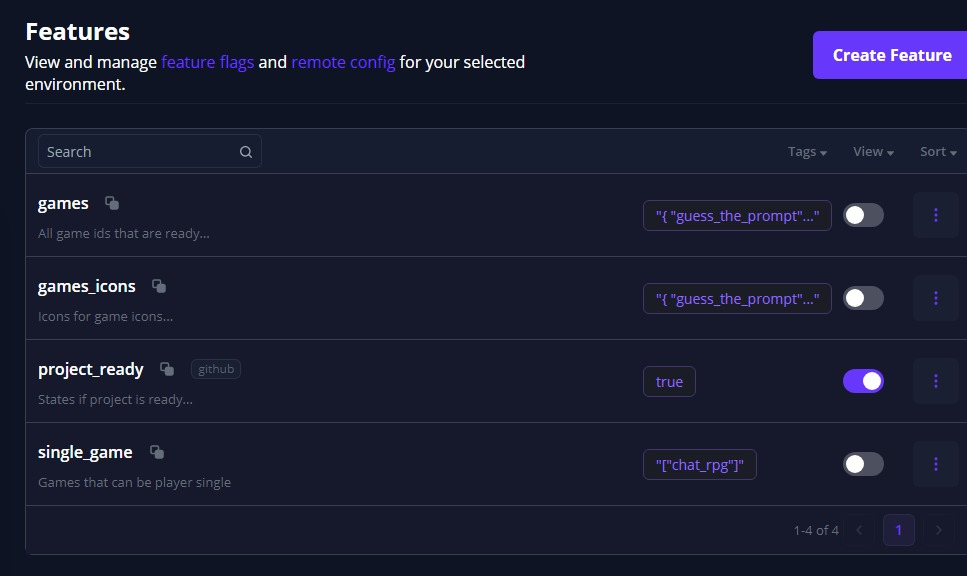

# 🌀 Minimal Text Games 🌀

Welcome to the exciting world of Minimal Text Games! Get ready for an immersive gaming experience powered by cutting-edge AI technology. 🚀

<p align="center"></p>

> [!NOTE]
> Introducing our AI-powered player games, created with love! Our backend relies on Mongo DB and Sockets to provide a full real-time gaming experience. With a wide variety of captivating games to choose from, there's something for everyone. Dive into the world of multiple games and let the excitement begin!

---

## 📚 Description

> Introducing our AI-powered text-based games, created with love! 💖 Our backend relies on MongoDB and Sockets to provide a full real-time gaming experience. With a wide variety of captivating games to choose from, there's something for everyone. Dive into the world of multiplayer or single-player games and let the excitement begin!

# 🎮 Demos

### 🖼️ Screenshots

> Here's a sneak peek at some of the games in action:


| Guess the Prompt! [Multi Player] |
|------------|
|  |

| Decode owo-fied text! [Multi Player] |
|------------|
|  |

| Chat RPG! [Single Player] |
|------------|
|  |

| Multiplayer Game Results |
|------------|
|  |


<p align="center"><strong>And more games are on the way! 🎉</strong></p>

### 📹 Video Demos

> Want to see the games in action? Check out this video demo:

- #### 🙅‍♀️ Guess the Image Prompt!

| [Player1 (Host)](static/guess_the_prompt_desktop.webm) |
|------------|
|  |

| [Player2 (Guest)](static/guess_the_prompt_mobile.webm) |
|------------|
|  |

- #### 🦉 Decode Owoify Text!

| [Player1 (Host)](static/owoify_text_desktop.webm) |
|------------|
|  |

| [Player2 (Guest)](static/owoify_text_mobile.webm) |
|------------|
|  |


### 🤼‍♂️ Addons

> Here's a sneak peek at some addons to site

| Content Menu |
|------------|
|  |

| Flagsmith Notifications |
|------------|
|  |


---

## 🛠️ Tech Stack

> Minimal Text Games is built using the following technologies:

> [!TIP]
> - **Frontend**: SvelteKit, Tailwind CSS, Shadcn ui
> - **Backend**: MongoDB, Prisma, Flagsmith
> - **AI Integration**: OpenAI, DALL-E

## 🚀 Getting Started

> Follow these steps to run Minimal Text Games locally:

- Clone the repository:
   ```
   git clone https://github.com/ArnavK-09/minimal-text-games.git
   ```

- Install dependencies:
   ```bash
   cd minimal-text-games
   npm install
   ```
- Install SHADCN components:
   ```bash
   npm run ui
   ```

- Set up environment variables **{ Example:-  [` .env.example `](.env.example) file }** for MongoDB, Prisma, and other services.

- Start the development server:
   ```bash
   npm run dev
   ```

- Open your browser and navigate to [**` http://localhost:5173 `**](http://localhost:5173) to see the app in action.

---

## 🧏‍♀️ Contributing

We welcome contributions to make Minimal Text Games even better! Here's how you can get involved:

> [!IMPORTANT]
> 
> 1. Fork the repository.
> 2. Create a new branch for your feature or bug fix.
> 3. Make your changes and commit them with descriptive messages.
> 4. Push your changes to your forked repository.
> 5. Submit a pull request to the main repository, describing your changes in detail.

## 🏁 Flagsmith Config

| Flagsmith Admin Panel |
|------------|
|  |

---

## 🌟 Show Your Support

> [!TIP]
> If you like Minimal Text Games, please consider giving it a ⭐️ on GitHub! Your support means a lot to us. 🙏


<p align="center"><strong>Thanks for checking out Minimal Text Games! Happy gaming! 👋</strong></p>

---
---

> [!CAUTION]
> For optimal performance and stability, please be aware that the **Socket.io plugin with Svelte Kit may exhibit some instability**, potentially hindering its production functionality. To ensure a smooth user experience, we kindly request testing the application on the development server utilizing the command **` npm run dev `**. **Thank you** for your cooperation in ensuring the reliability of our application.
